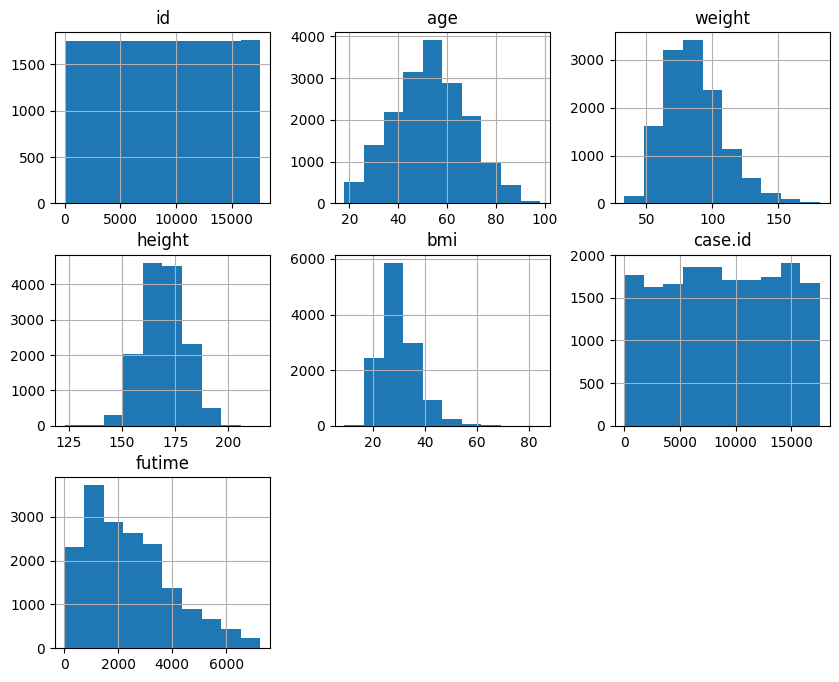
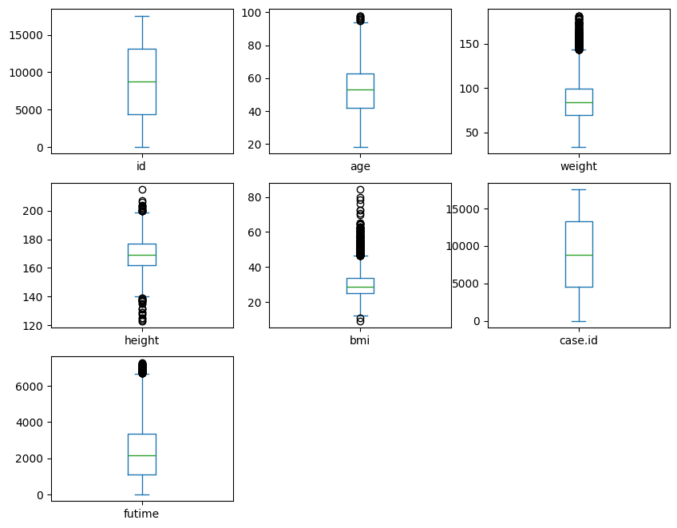
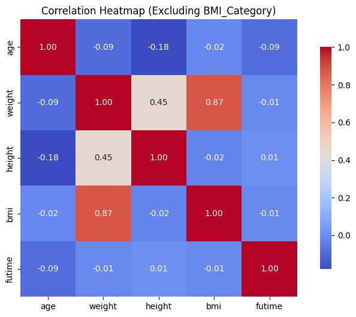
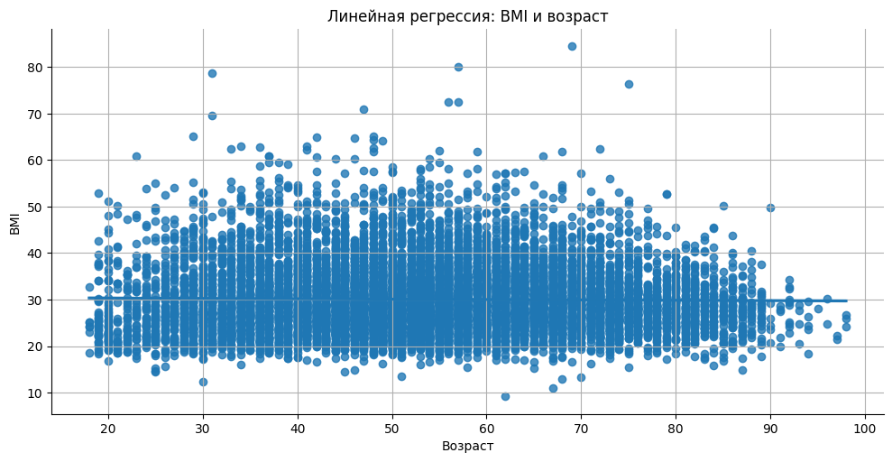
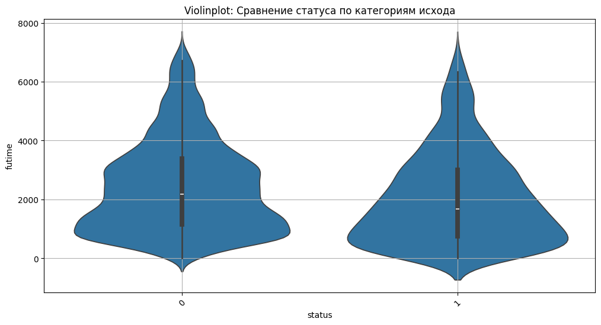
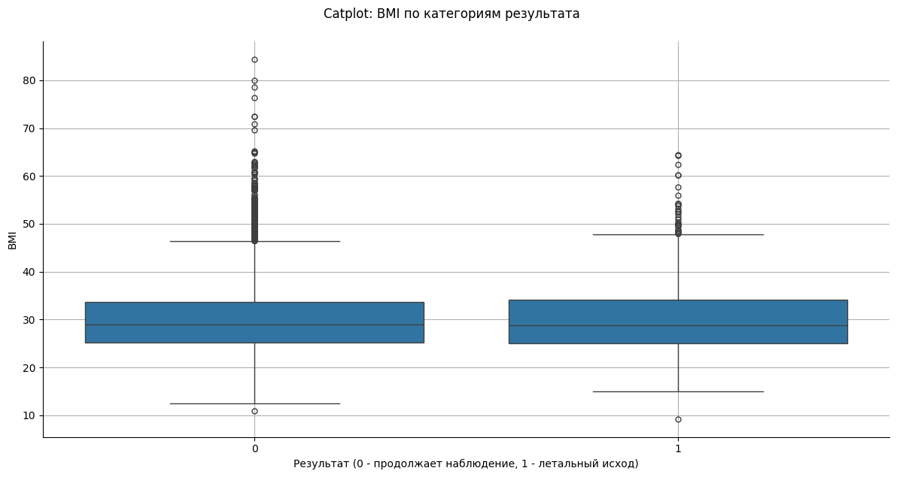

# 
***Итоговый проект "Очистка и визуализация данных"***

В данной работе мы проведем анализ 3 датасетов с платформы kaggle.com с набором данных о НАЖБП (неалкогольной жировой болезни печени), выполним базовый анализ предоставленных файлов, построим визуализации, проведем очистку данных и сделаем выводы.

*К сожалению, для работы нам предоствлен ошибочный набор датасетов, и [третий_датасет](https://www.kaggle.com/code/rajathrpai/missing-file-nafld3-csv) находится в комментариях.*

### 
**НАЖБП**

НАЖБП – это состояние, описываемое как избыточное накопление жира в форме триглицеридов (стеатоз) в печени (гистологически в > 5% гепатоцитов). У подгруппы пациентов с НАЖБП имеется повреждение клеток печени и воспаление в дополнению к избыточному жиру (стеатогепатит). Последнее состояние, носящее название НАСГ, буквально неотличимо гистологически от алкогольного стеатогепатита (АСГ). В то время как простой стеатоз, наблюдаемый при НАЖБП не коррелирует с ростом кратковременной заболеваемости и смертности, прогрессирование заболевания до НАСГ резко увеличивает риск развития цирроза, печеночной недостаточности и гепатоцеллюлярной карциномы (ГЦК). Цирроз, вызванный НАСГ – это более частая причина для трансплантации печени. Так как заболеваемость и смертность пациентов с НАСГ значительно возрастают, они еще сильнее коррелируют заболеваемостью и смертностью от сердечно-сосудистых заболеваний.

# 
 **Визуализация данных**

**Histogram**

**Box Plot**

**Correlation Heatmap**

**Lmplot**

**Violin plot**

**Catplot**

#### 
**Выводы из проведенного исследования**

- Вес ожидаемо показал сильную положительную корреляцию с BMI (r = 0.87)
- Рост показал слабую корреляцию с BMI (r = 0.45)
- между 'male' и 'status' практически нет корреляции (r = 0.02)
- женщины преобладают в приведенном исследовании, 53%
- нет значительной разницы между количеством дней наблюдений и статусом заболевания

### 
**Итоги**

К сожалению, в данном исследовании исследовался только один фактор риска - увеличение массы тела, но не указано, вследствии какого из факторов риска. Можем сделать только вывод о том, чем выше BMI, тем хуже прогноз.
В дальнейшем для использования данных в медицинских целях рекомендуется рассмотреть следующие факторы риска:

**Факторы риска развития НАЖБП**:

- Несбалансированное питание, употребление жирной, жареной пищи, сладкого, злоупотребление кофеином, никотином, алкоголем
- Хронический стресс
- Ожирение, высокий уровень холестерина и триглицеридов в крови
- Генетические факторы
- Сопутствующая патология (сахарный диабет II типа, заболевания сердечно-сосудистой системы, гормональные и обменные нарушения).

**Профилактика развития НАЖБП**
[по данным ВОЗ](https://www.worldgastroenterology.org/guidelines/nafld-nash/nafld-nash-russian)
- добиться здоровой массы тела и поддерживать ее;
- поддерживать физически активный образ жизни, уделяя не менее 150 минут в неделю физическим упражнениям умеренной интенсивности;
- соблюдать здоровый рацион питания и уменьшать потребление сахаров и насыщенных жиров

