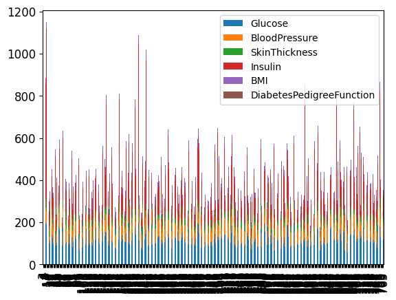
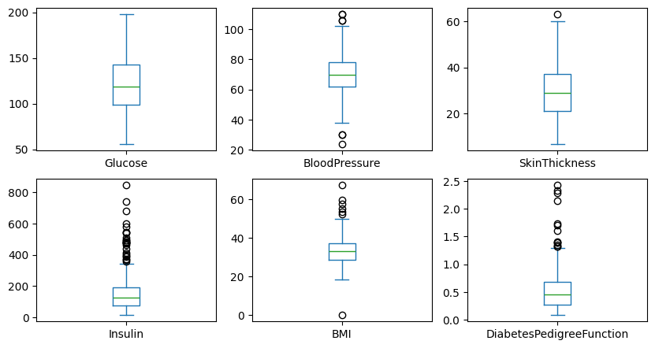
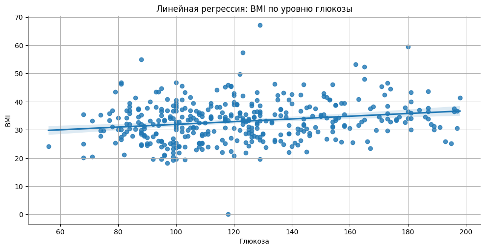
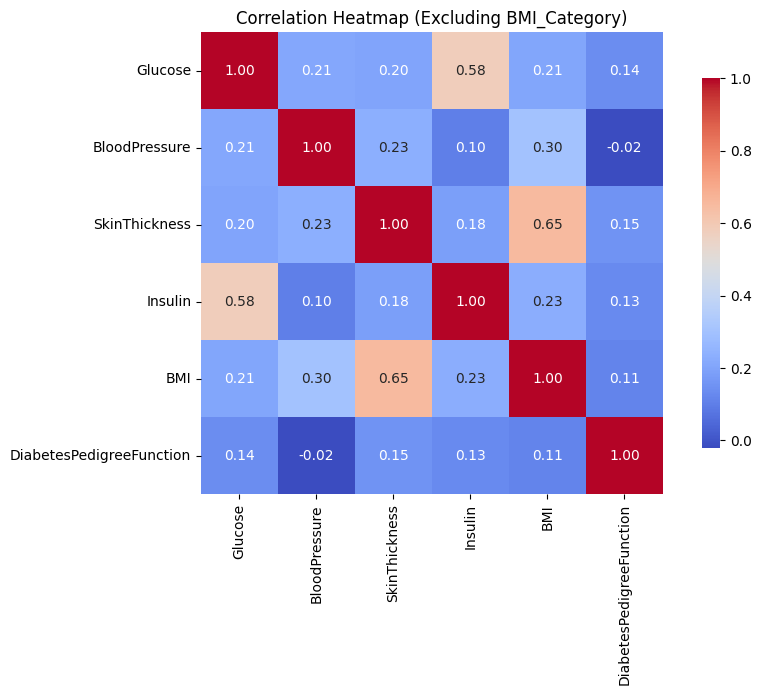

# 
***Итоговый проект для курса Data Science в медицине***

В данной работе мы проведем анализ 3 датасетов с платформы kaggle.com.

*В [первом_датасете](https://www.kaggle.com/datasets/mathchi/diabetes-data-set) в выборке представлены исключительно женщины из племени Пима с наличием/отсутствием сахарного диабета, [второй_датасет](https://www.kaggle.com/datasets/christofel04/cardiovascular-study-dataset-predict-heart-disea) посвящен сердечно-сосудистым заболеваниям, и [третий_датасет](https://www.kaggle.com/datasets/alexteboul/diabetes-health-indicators-dataset) основан на данных телефонного опроса граждан США и связан с факторами риска развития сахарного диабета.*

### 
**Факторы риска развития сахарного диабета**

К факторам высокого риска относят:
+ ожирение (индекс массы тела ≥ 30 кг/м²)
+ наследственность (наличие у родственников первой линии родства сахарного диабета 2 типа)
+ гестационный сахарный диабет или другие нарушения углеводного обмена в прошлом

*по данным ВОЗ,  ["Глобальный доклад по диабету"](https://iris.who.int/bitstream/handle/10665/275388/9789244565254-rus.pdf)* [ВОЗ](https://www.un.org/youthenvoy/wp-content/uploads/2014/09/WHO.jpg) 

Среди индейцев племени пима, живущих на территории США зафиксирован самый высокий в мире процент заболеваемости сахарным диабетом 2 типа. Данная проблема лишь частично обусловлена генетически, поскольку заболеваемость этим типом диабета практически отсутствует среди индейцев-пима, живущих в Мексике. Спусковым механизмом для данного заболевания стало разрушение традиционной экономики племени и переход к новому питанию.[Wikipedia](https://ru.wikipedia.org/wiki/%D0%9F%D0%B8%D0%BC%D0%B0)

# 
 **Визуализация данных**

**Horizontal Bar Plot**

**Box Plot**

**Lmplot**

**Correlation Heatmap**

#### 
**Выводы из проведенного исследования**

Уровень глюкозы показывает сильную положительную корреляцию с наличием диабета (r = 0.51).
Уровень инсулина показывает слабую корреляцию с наличием диабета (r = 0.30)
Между уровнем BP и наличием диабета нет корреляции

Наибольший риск развития диабета наблюдается у возрастной группы 50–60 лет.

### 
**Заключение**

1. Внешние факторы, оказывающие сильное влияние на развитие сахарного диабета:
- ИМТ
- возраст
- беременность

2. Внутренние факторы, оказывающие сильное влияние на развитие сахарного диабета:
- уровень глюкозы
- уровень инсулина

3. Факторы, не оказывающие влияния на развитие сахарного диабета:
- толщина кожи
- артериальное давление

**Профилактика развития сахарного диабета**
[по данным ВОЗ](https://www.who.int/ru/news-room/fact-sheets/detail/diabetes)
- добиться здоровой массы тела и поддерживать ее;
- поддерживать физически активный образ жизни, уделяя не менее 150 минут в неделю физическим упражнениям умеренной интенсивности;
- соблюдать здоровый рацион питания и уменьшать потребление сахаров и насыщенных жиров;
- измерение уровня глюкозы у беременных для выявления гестационного сахарного диабета

